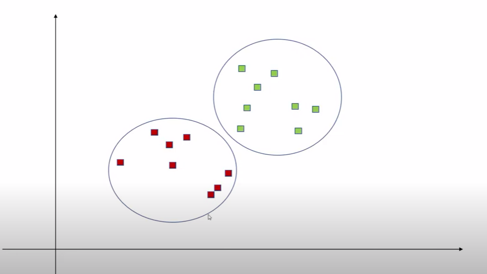
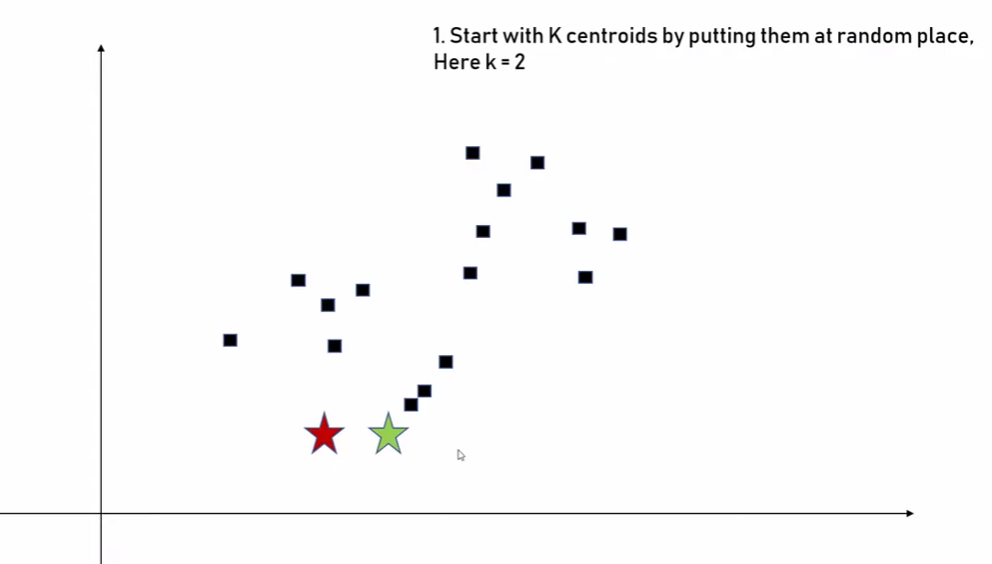
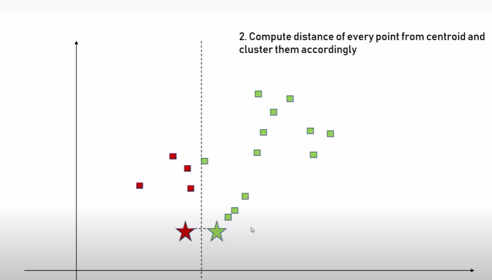
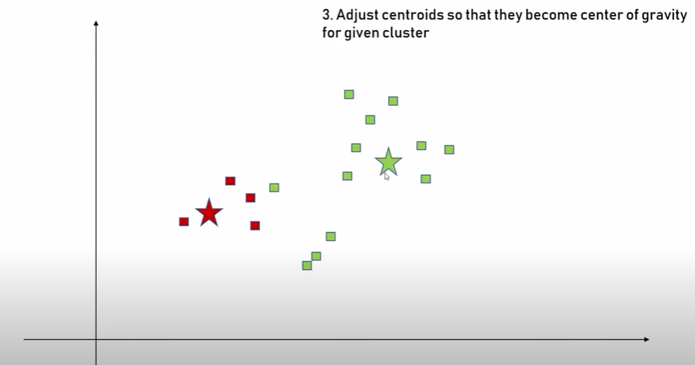
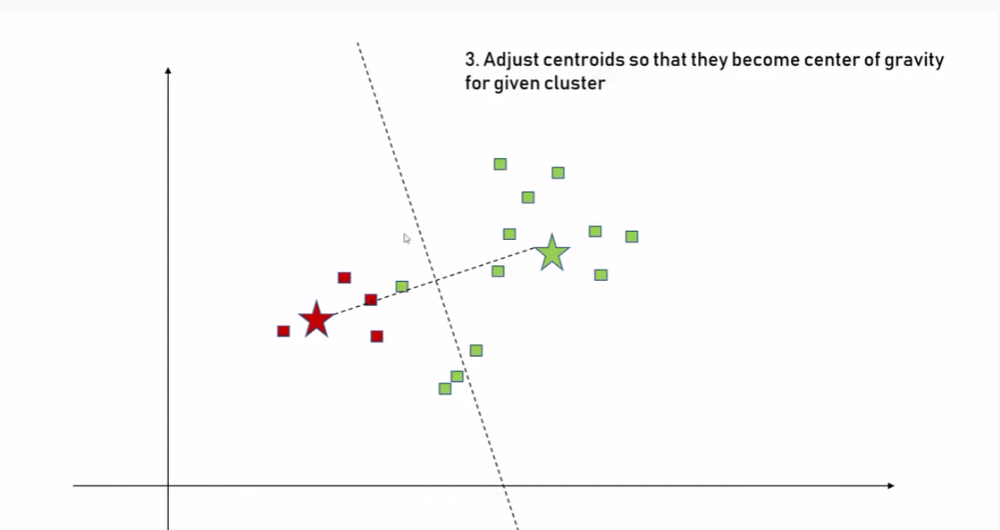
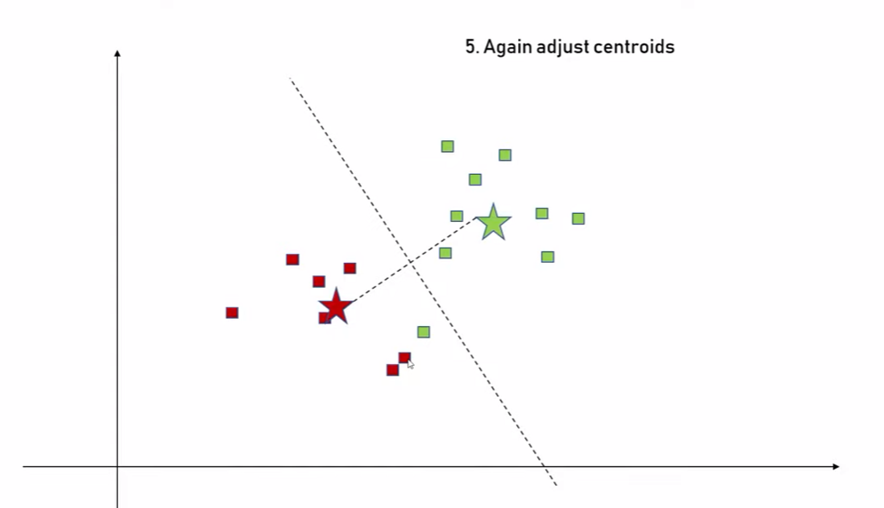
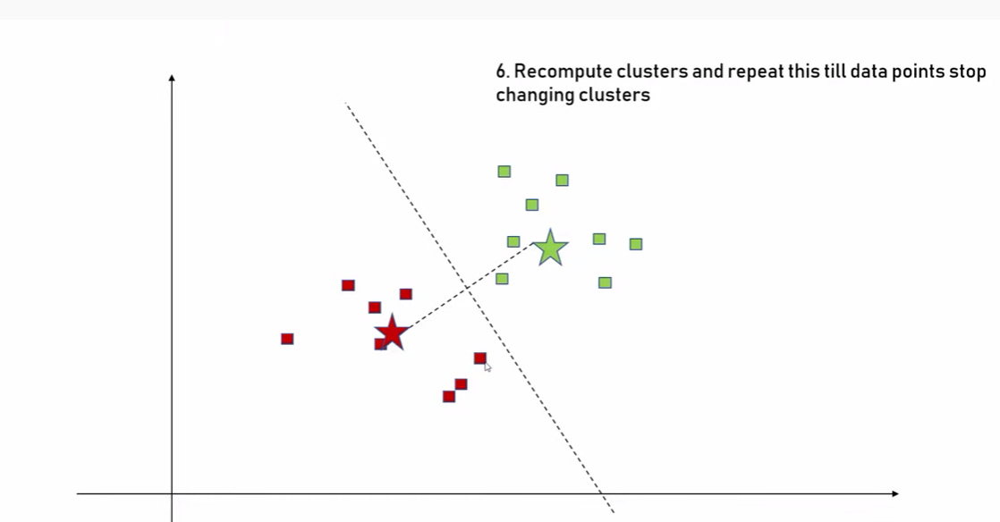
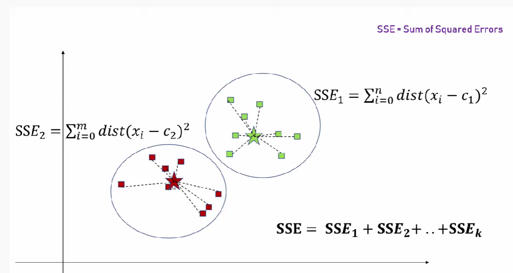
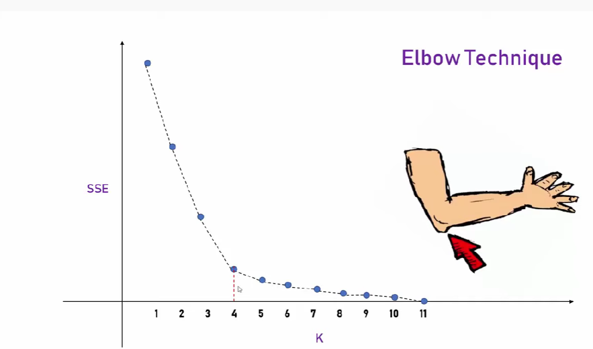

# K_mean CLustering

K-means is an unsupervised learning method for clustering data points. The algorithm iteratively divides data points into K clusters by minimizing the variance in each cluster.

Here, we will show you how to estimate the best value for K using the elbow method, then use K-means clustering to group the data points into clusters.

 

 
### How does it work?

How does it work?
First, each data point is randomly assigned to one of the K clusters. Then, we compute the centroid (functionally the center) of each cluster, and reassign each data point to the cluster with the closest centroid. We repeat this process until the cluster assignments for each data point are no longer changing.

K-means clustering requires us to select K, the number of clusters we want to group the data into. The elbow method lets us graph the inertia (a distance-based metric) and visualize the point at which it starts decreasing linearly. This point is referred to as the "eblow" and is a good estimate for the best value for K based on our data.

 

 

# Advantages and Disadvantages of K_mean CLustering

* Pros

1. Simple: It is easy to implement k-means and identify unknown groups of data from complex data sets. The results are presented in an easy and simple manner.

2. Flexible: K-means algorithm can easily adjust to the changes. If there are any problems, adjusting the cluster segment will allow changes to easily occur on the algorithm.

3. Suitable in a large dataset: K-means is suitable for a large number of datasets and it’s computed much faster than the smaller dataset. It can also produce higher clusters.

4. Efficient: The algorithm used is good at segmenting the large data set. Its efficiency depends on the shape of the clusters. K-means works well in hyper-spherical clusters.

* Cons

1. NoNo-optimal set of clusters: K-means doesn’t allow the development of an optimal set of clusters and for effective results, you should decide on the clusters before.
2. Lacks consistency: K-means clustering gives varying results on different runs of an algorithm. A random choice of cluster patterns yields different clustering results resulting in inconsistency.

3. Uniform effect: It produces clusters with uniform sizes even when the input data has different sizes.

4. Order of values: The way in which data is ordered in building the algorithm affects the final results of the data set.

5. Sensitivity to scale: Changing or rescaling the dataset either through normalization or standardization will completely change the final results.

 
You can see my notebook. All  the work is explained in detail.

### AUTHOR

<strong>Shehryar Gondal</strong>

You can get in touch with me on my LinkedIn Profile: 
 

You can also follow my GitHub Profile to stay updated about my latest projects: 

If you liked the repo then kindly support it by giving it a star ⭐.